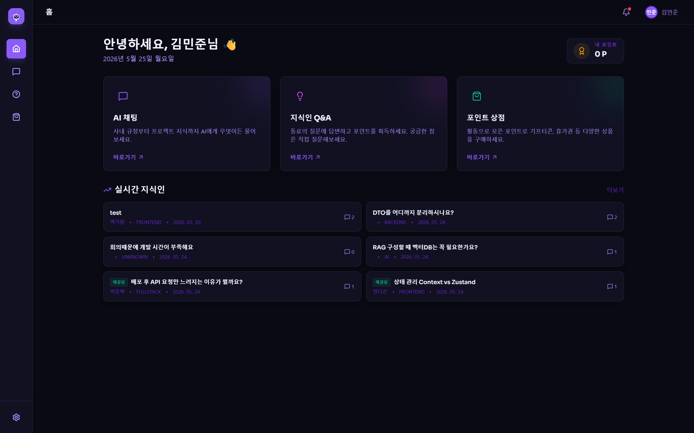
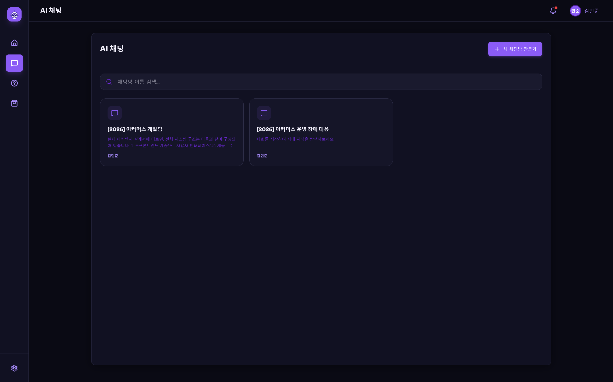
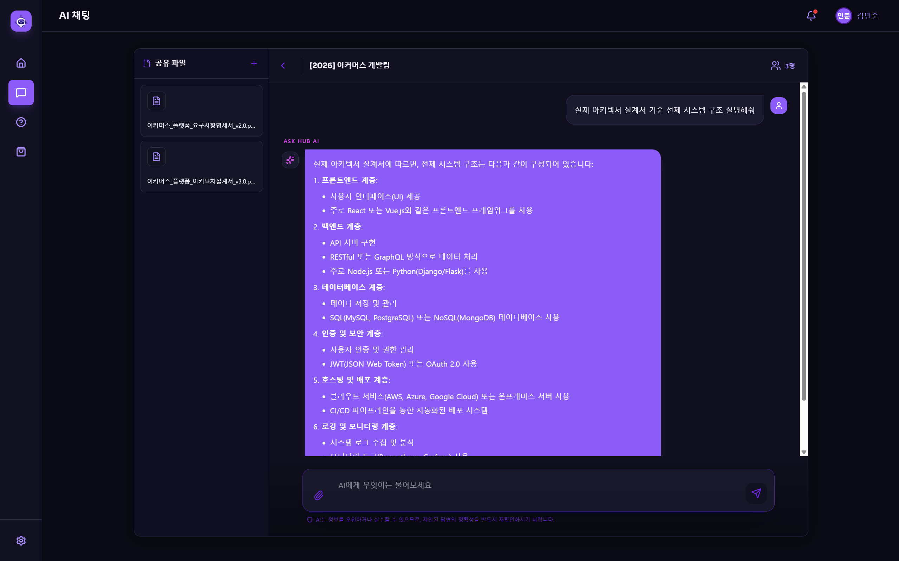
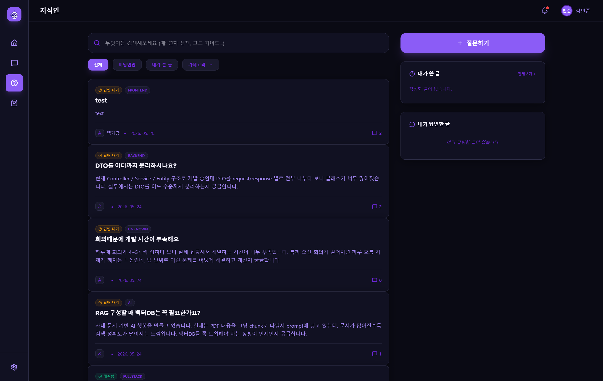
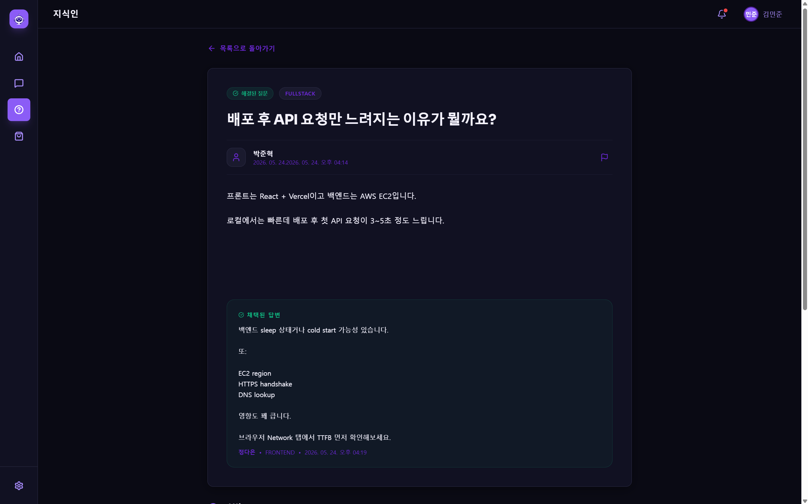
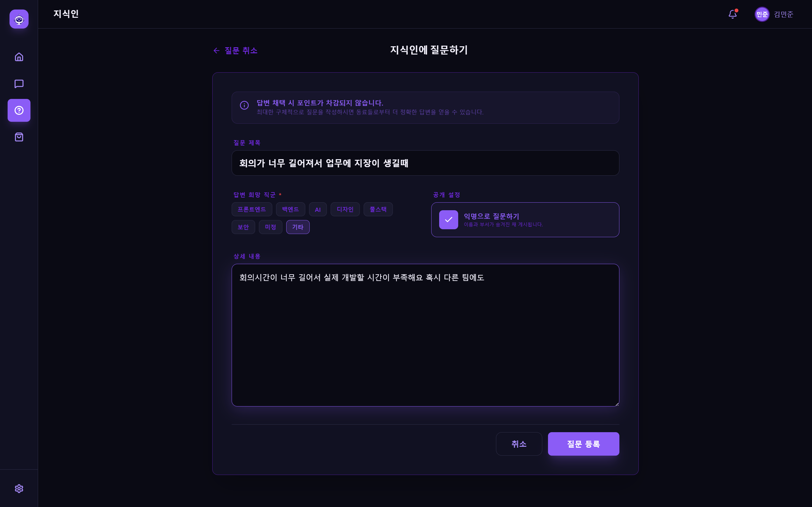
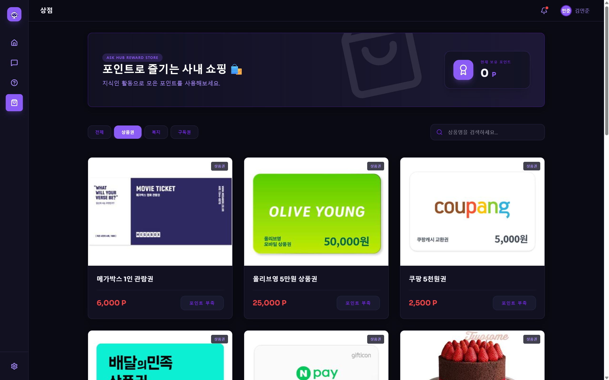
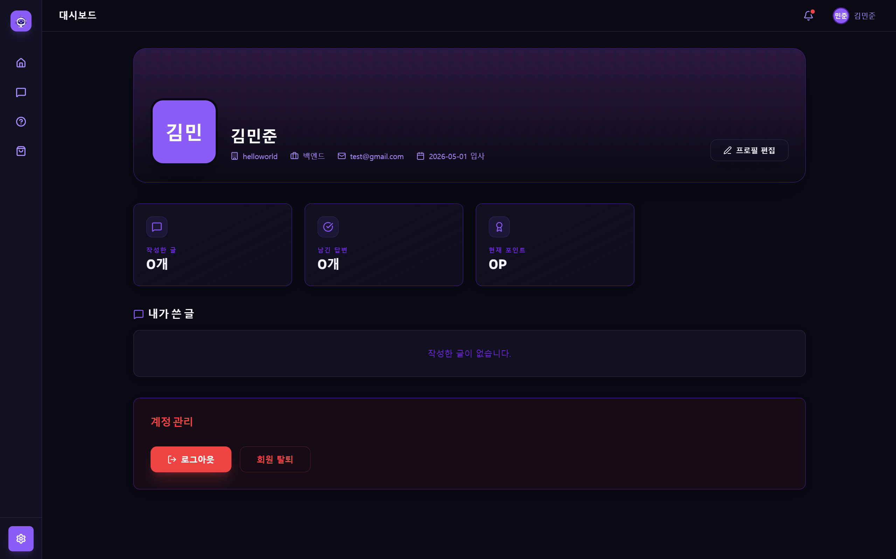

# Ask Hub - Frontend

> 사내 지식 공유와 AI 협업을 하나로 연결한 플랫폼

<br />

## 📌 프로젝트 소개

**Ask Hub**는 사내 문서를 기반으로 AI와 대화하고, 동료 간 질문·답변을 통해 자연스럽게 지식을 축적하는 사내 협업 플랫폼입니다.

- 팀 단위로 회사 문서를 공유하고, 각자 AI와 1:1로 대화하며 필요한 정보를 즉시 탐색할 수 있습니다.
- 동료의 질문에 답변하고 답변이 채택되면 포인트가 지급되어 자연스러운 지식 공유 문화를 형성합니다.

> 본 레포지토리는 **Frontend** 전용 레포지토리 입니다.

<br />

## 🔗 프론트 배포 링크

> **[Ask Hub link](https://your-vercel-url.vercel.app)**

<br />

## 🛠 기술 스택

| 분류 | 기술 |
|------|------|
| Framework | React, TypeScript |
| Build Tool | Vite |
| Styling | Tailwind CSS |
| 상태관리 | React Context API |
| HTTP 클라이언트 | Axios |
| 라우팅 | React Router DOM v6 |
| 애니메이션 | Framer Motion |
| 마크다운 렌더링 | React Markdown, remark-gfm |
| 아이콘 | Lucide React |
| 배포 | Vercel |

<br />

## 📁 프로젝트 구조

```
src/
├── components/           # 공통 컴포넌트
│   └── layout/           # AppLayout, 사이드바, 헤더
├── context/              # 전역 상태
│   └── AuthContext.tsx   # 로그인 유저 정보 관리
├── pages/                # 페이지 컴포넌트
│   ├── auth/             # 로그인, 회원가입
│   ├── chat/             # AI 채팅
│   ├── dashboard/        # 메인 홈
│   ├── knowledge/        # 지식인 : 글 목록, 글 생성, 글 상세
│   ├── mypage/           # 마이페이지
│   └── store/            # 포인트 스토어
├── router/               # 라우팅 보호 (PrivateRoute)
├── services/             # API 통신 함수 정의 
│   ├── api.ts            # Axios 인스턴스 + 인터셉터
│   ├── authService.ts    # 인증 관련 API
│   ├── userService.ts    # 유저 관련 API
│   ├── postService.ts    # 지식인 게시글 관련 API 
│   ├── commentService.ts # 지식인 댓글 관련 API
│   ├── teamService.ts    # AI채팅 팀 관련 API
│   └── sessionService.ts # AI채팅 세션/메시지 관련 API
├── types/                # TypeScript 타입 정의
│   ├── auth.ts           
│   ├── user.ts
│   ├── post.ts
│   ├── comment.ts
│   ├── team.ts
│   └── session.ts
├── mock/                 # 더미 데이터
│   └── data.ts           # 상점 더미 데이터
└── utils/                # 유틸 함수
    └── time.ts           # 날짜 변환 함수
```

<br />

## ✨ 주요 기능

### 🤖 AI 채팅
- 팀 단위 채팅방 생성 및 팀원 초대
- 회사 문서(PDF 등) 업로드 → 문서 기반 AI 답변
- 마크다운 형식의 AI 응답 렌더링
- 방장 별도 권한 : 파일 업로드, 참여자 초대, 방 삭제

### 💬 지식인 Q&A
- 직군별 카테고리 단일 필터링
- 키워드 검색
- 미답변 / 전체 / 내가 쓴 글 필터
- 답변 채택 시 포인트 지급( 50P )
- 익명 질문 지원
- 페이지네이션 (hasNext 기반)

### 👤 회원 관리
- 회원가입시 이메일 중복 확인
- 회원가입 / 로그인 / 로그아웃 / 회원탈퇴
- JWT AccessToken + RefreshToken 기반 인증
- 토큰 만료(401/403) 시 자동 재발급 (Axios 인터셉터)
- 프로필 편집

### 📊 마이페이지
- 활동 통계 (작성 글, 답변 수, 포인트)
- 내가 쓴 글 목록

<br />

## 🔐 인증 흐름

```
로그인
  → AccessToken + RefreshToken 발급
  → LocalStorage 저장
  → Axios 요청 인터셉터에서 자동 첨부

토큰 만료 (401 / 403)
  → /auth/reissue 자동 호출
  → 새 토큰으로 원래 요청 재시도
  → reissue 실패 시 로그인 페이지로 이동
```

<br />

## 📄 페이지 구성

| 경로 | 페이지 | 접근 권한 |
|------|--------|-----------| 
| `/login` | 로그인 | 공개 |
| `/register` | 회원가입 | 공개 |
| `/dashboard` | 대시보드 | 인증 필요 |
| `/chat` | AI 채팅 | 인증 필요 |
| `/knowledge` | 지식인 목록 | 인증 필요 |
| `/knowledge/write` | 질문 작성 | 인증 필요 |
| `/knowledge/post/:id` | 게시글 상세 | 인증 필요 |
| `/mypage` | 마이페이지 | 인증 필요 |
| `/store` | 포인트 스토어 | 인증 필요 |

## 메인 화면




## ai채팅 화면




## 지식인 화면





## 상점 화면




## 설정 화면




<br />


## 📅 개발 기간

 - 3월 :  기획 회의, 인터뷰, 요구사항 정리
 - 4월 : 시스템 아키텍처 설계, 화면 디자인, 중간 발표 준비
 - 5월 : UI제작, API연동, Vercel 배포, 최종 발표 준비

> **[프로토타입 디자인 link](https://www.figma.com/design/8CG24GgAmz8x5jYCjeCzEZ/ask-hub?node-id=0-1&t=dS8HS5JvzQI6eDhl-1)**
<br />

## 🎯 트러블슈팅

### 1. CORS 및 인증 예외 처리
- 문제
  - 배포 후 이메일 중복 확인 API에서 403 Forbidden 발생
  - OPTIONS preflight는 성공했지만 실제 XHR 요청 실패
- 원인
  - 로그인 전 API임에도 Authorization 검증 적용
  - Vercel 배포 도메인이 CORS 허용 목록에 없음
- 해결
  - 인증 예외 처리 적용
  - Vercel URL을 CORS 허용 origin에 추가
### 2. multipart/form-data 팀 생성 오류
- 문제
  - 팀 생성할때 파일 미첨부 시 multipartFileList is null
  - 파일 첨부 시 JSON 파싱 오류 발생
- 원인
  - 백엔드 multipart null 체크 누락
  - JSON body와 multipart/form-data 요청 구조 불일치
- 해결
  - FormData 기반 요청 구조로 변경
  - 파일 null 처리 로직 추가
### 3. 메시지 저장 DB  오류
- 문제
  - 메시지 전송 시 user_team_id violates not-null constraint 발생
- 원인
  - 백엔드에서 UserTeam 매핑 누락
- 해결
  - teamId 기반 UserTeam 조회 및 message 엔티티 매핑 수정
### 4. AI 답변 가독성 문제
- 문제
  - 코드블록, 줄바꿈, 리스트 등이 문자열 그대로 출력됨
- 해결
  - react-markdown, remark-gfm 적용
  - Markdown 기반 AI 메시지 렌더링 구현
### 5. 권한 기반 UI 제어
- 문제
  - 일반 사용자도 채팅 내부에서 참여자 초대 버튼 클릭 가능
- 해결
  - 방장 여부(captainName) 기준 권한 분기
  - 방장 외 사용자는 버튼 비활성화 처리

<br />
